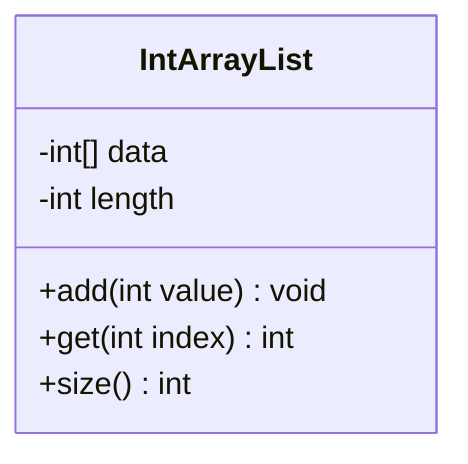
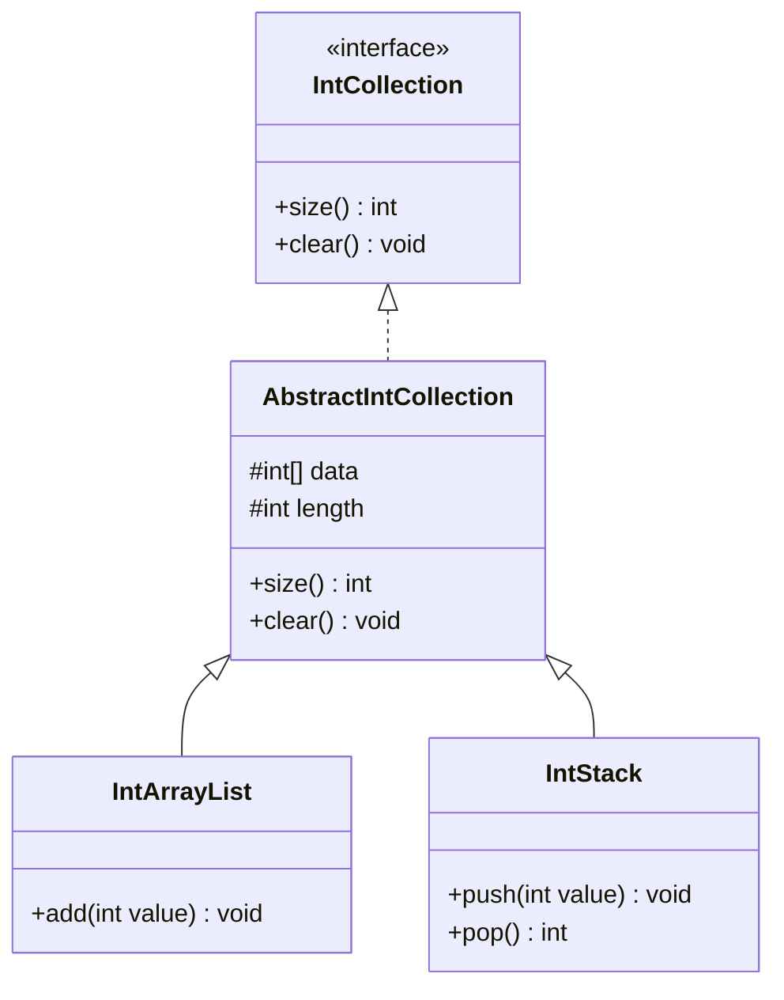
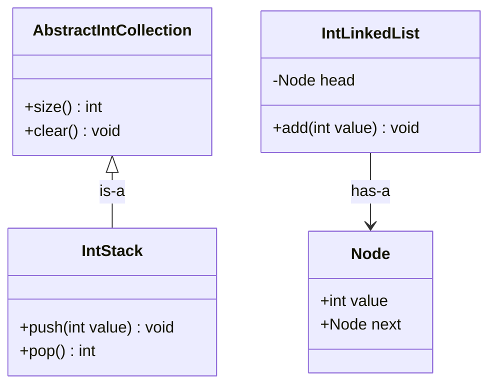
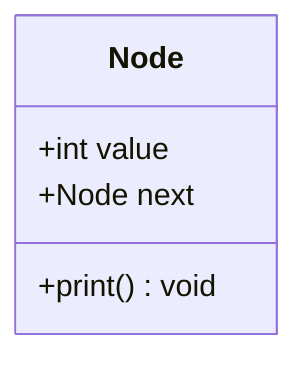
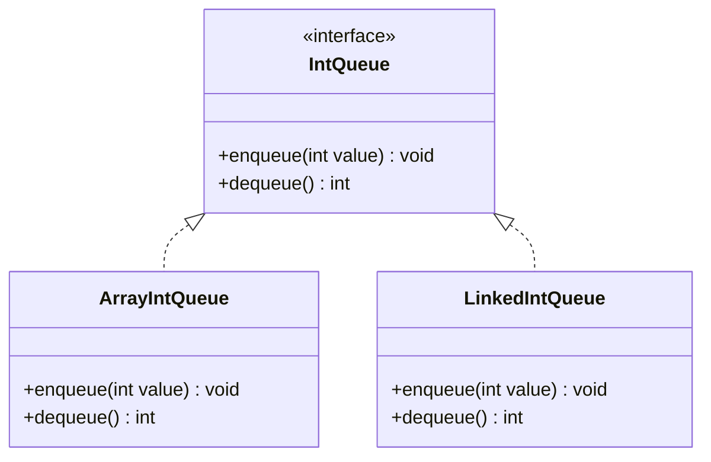

# UMLを用いたオブジェクト指向設計

## システムの全体像を把握する課題

これまでの学習で、インターフェースやクラスの継承を用いて、機能ごとにプログラムを分割する方法を学びました。
しかし、作成するクラスやインターフェースの数が増えてくると、コードを読むだけではプログラムの全体像を把握することが難しくなります。
「どのクラスがどのインターフェースを実装しているか」や「どのクラスがどの親クラスを継承しているか」を頭の中だけで整理するには限界があります。
設計の全体像をチーム開発で共有したり、実装前に構造を検討したりするためには、視覚的な図解が必要になります。

## UMLとクラス図

そこで、オブジェクト指向設計の設計図として世界中で標準的に用いられているのが**UML**（統一モデリング言語）です。
UMLには用途に応じて様々な図が定義されていますが、中でもクラスの構造や関係性を表す**クラス図**は最も頻繁に使用されます。
クラス図を作成することで、プログラムを書く前にクラス同士の関係性を整理し、設計の妥当性を検証することができます。

## クラスの表現とアクセス修飾子

クラス図では、1つのクラスを四角形で表し、上から順に「クラス名」「属性（フィールド）」「操作（メソッド）」の3つの区画に分けて記述します。
また、アクセス修飾子は記号を用いて表現し、`+` は `public`、`-` は `private`、`#` は `protected` を表します。

本資料では、クラス図などの描画に**Mermaid**という記法を使用します。
Mermaidは、テキストコードを記述するだけで自動的に図形やチャートを生成できるツールです。
クラス図を描く場合は、最初に `classDiagram` と宣言し、その下に `class クラス名 { ... }` の形式でクラスの構造やメンバーを記述します。

クラス図の実例と、それを描画するためのMermaidのソースコードは以下のようになります。

```text:Mermaidのソースコード
classDiagram
  class IntArrayList {
    -int[] data
    -int length
    +add(int value) void
    +get(int index) int
    +size() int
  }
```



上記のクラス図をプログラムで表現すると、以下のようになります。

```java:IntArrayList.java
class IntArrayList {
  private int[] data = new int[100];
  private int length = 0;

  public void add(int value) {
    this.data[this.length] = value;
    this.length++;
  }

  public int get(int index) {
    return this.data[index];
  }

  public int size() {
    return this.length;
  }
}
```

## クラス間の関係の表現

クラス図のもう一つの重要な役割は、クラスやインターフェース間の「関係性」を線と矢印で表現することです。
主な関係性として、以下の表現がよく使われます。

* **継承（汎化）**: 子クラスから親クラスへ、実線の白抜き矢印を引きます。
* **実現（インターフェースの実装）**: 実装するクラスからインターフェースへ、破線の白抜き矢印を引きます。
* **関連**: クラスが別のクラスをフィールドとして持っているなど、何らかの関係がある場合に実線の矢印を引きます。

前回の授業で扱ったコレクションの継承関係を表すクラス図は以下のようになります。
インターフェース名の前には `<<interface>>` という目印をつけます。

```text:Mermaidのソースコード
classDiagram
  class IntCollection {
    <<interface>>
    +size() int
    +clear() void
  }

  class AbstractIntCollection {
    #int[] data
    #int length
    +size() int
    +clear() void
  }
  
  class IntArrayList {
    +add(int value) void
  }
  
  class IntStack {
    +push(int value) void
    +pop() int
  }
  
  IntCollection <|.. AbstractIntCollection
  AbstractIntCollection <|-- IntArrayList
  AbstractIntCollection <|-- IntStack
```



上記のように図解することで、`AbstractIntCollection` がインターフェースを実装し、さらに `IntArrayList` と `IntStack` の親クラスになっている構造が一目でわかります。
プログラムを書く前にこのようなクラス図を描くことで、無駄なクラスがないか、役割分担が適切かを効率よく検討することができます。

## is-a関係とhas-a関係

オブジェクト指向設計でクラスの構造を考える際、クラス間の関係性を「is-a関係」と「has-a関係」という言葉で整理することがよくあります。
これらの関係性を意識することで、継承を使うべきか、関連（クラスをフィールドとして持つ）を使うべきかの判断がしやすくなります。

* **is-a関係**（〜は〜の一種である）: クラスが別のクラスを「継承」している、またはインターフェースを「実装」している関係を指します。
  * 例：「スタック（`IntStack`）はコレクション（`AbstractIntCollection`）の一種である」（`IntStack is an AbstractIntCollection`）。
  * この場合、クラス図では継承や実現の矢印（白抜き矢印）を用いて表現します。
* **has-a関係**（〜は〜を持っている）: クラスが別のクラスをフィールドとして「保持」している、または「利用」している関係を指します。
  * 例：「連結リスト（`IntLinkedList`）はノード（`Node`）を持っている」（`IntLinkedList has a Node`）。
  * この場合、クラス図では関連の矢印（通常の矢印）を用いて表現します。

クラス図でis-a関係とhas-a関係を比較すると、以下のようになります。

```text:Mermaidのソースコード
classDiagram
  class AbstractIntCollection {
    +size() int
    +clear() void
  }
  
  class IntStack {
    +push(int value) void
    +pop() int
  }
  
  class Node {
    +int value
    +Node next
  }
  
  class IntLinkedList {
    -Node head
    +add(int value) void
  }
  
  AbstractIntCollection <|-- IntStack : is-a
  IntLinkedList --> Node : has-a
```



むやみに継承（is-a関係）を多用すると、親クラスと子クラスの結びつきが強くなりすぎ、変更に弱いプログラムになってしまうことがあります。
そのため、「本当にis-a関係が成り立つか」を慎重に検討し、成り立たない場合は関連（has-a関係）にする、という設計方針が非常に重要です。

## 演習

### 演習1
オブジェクト指向設計において、クラス図を作成する目的とメリットを述べなさい。

### 演習2
以下の仕様を満たす連結リストの `Node` クラスを設計し、Mermaid記法を用いてクラス図を作成しなさい（プログラムのコードは書かないこと）。
* `public` な整数型のフィールド `value`
* `public` な `Node` 型のフィールド `next`
* `public` な戻り値なしのメソッド `print()`

### 演習3
「キュー」を表す `IntQueue` インターフェースと、それを実装する配列ベースの `ArrayIntQueue` クラスおよび連結リストベースの `LinkedIntQueue` クラスの関係性を表すクラス図を、Mermaid記法を用いて作成しなさい。
`IntQueue` インターフェースには、`public` な戻り値なしのメソッド `enqueue(int value)` と、`public` な整数型を返すメソッド `dequeue()` を定義しなさい。

### 演習4
演習3で作成したクラス図をもとに、Processingのプログラムとして `IntQueue` インターフェース、`ArrayIntQueue` クラス、`LinkedIntQueue` クラスを実装しなさい。
各メソッドの内部処理は、配列やリストの実際の操作ではなく、`"ArrayIntQueueに " + value + " を追加"` のようなダミーの `println` 出力で構いません。
また、`setup` 関数内でそれぞれのインスタンスを生成し、ポリモーフィズムを利用してメソッドを呼び出して動作を確認しなさい。

## 演習の解答例

### 演習1の解答例

場面: 複数のクラスやインターフェースが複雑に絡み合うシステムを設計・開発する場面。

理由: コードを書く前に設計の全体像を視覚的に把握することで、役割分担の妥当性や構造の欠陥を早期に発見できるためである。また、チーム開発において、他の開発者と設計の意図を正確に共有するための共通言語として機能するためである。

### 演習2の解答例

解答は以下の通りである。

```text:Mermaidのソースコード
classDiagram
  class Node {
    +int value
    +Node next
    +print() void
  }
```



### 演習3の解答例

インターフェースの実装は破線の白抜き矢印（`<|..`）で表現する。
クラス図は以下の通りである。

```text:Mermaidのソースコード
classDiagram
  class IntQueue {
    <<interface>>
    +enqueue(int value) void
    +dequeue() int
  }
  
  class ArrayIntQueue {
    +enqueue(int value) void
    +dequeue() int
  }
  
  class LinkedIntQueue {
    +enqueue(int value) void
    +dequeue() int
  }
  
  IntQueue <|.. ArrayIntQueue
  IntQueue <|.. LinkedIntQueue
```



### 演習4の解答例

実装例は以下の通りである。
それぞれのクラスをインスタンス化し、ポリモーフィズムを利用してメソッドを呼び出す。

```java:IntQueueTest.pde
interface IntQueue {
  void enqueue(int value);
  int dequeue();
}

class ArrayIntQueue implements IntQueue {
  public void enqueue(int value) {
    println("ArrayIntQueueに " + value + " を追加しました。");
  }

  public int dequeue() {
    println("ArrayIntQueueからデータを取り出しました。");
    return 0;
  }
}

class LinkedIntQueue implements IntQueue {
  public void enqueue(int value) {
    println("LinkedIntQueueに " + value + " を追加しました。");
  }

  public int dequeue() {
    println("LinkedIntQueueからデータを取り出しました。");
    return 0;
  }
}

void setup() {
  IntQueue q1 = new ArrayIntQueue();
  IntQueue q2 = new LinkedIntQueue();
  
  q1.enqueue(10);
  q2.enqueue(20);
  
  q1.dequeue();
  q2.dequeue();
}
```

```console:実行結果
ArrayIntQueueに 10 を追加しました。
LinkedIntQueueに 20 を追加しました。
ArrayIntQueueからデータを取り出しました。
LinkedIntQueueからデータを取り出しました。
```
